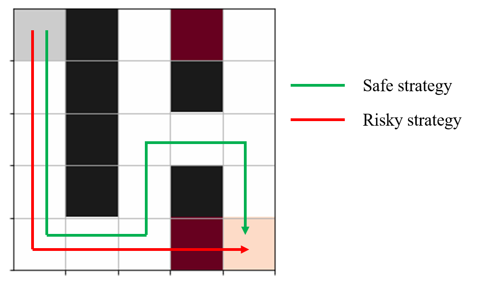

# **Distributional Reinforcement Learning and Risk Measures**

This repository regroups the main methods implemented during my internship at [UQAM](https://math.uqam.ca) in summer 2022 about *Distributional Reinforcement Learning and Risk Measures* supervised  by Arthur Charpentier.

This project includes two different environments described below and regroups several implementations of reinforcement learning and distributional reinforcement learning methods with a focus on risk-sensitive optimization.


## **1.Project Structure**


```
.
├── README.md
├── demo : various notebooks using implemented methods
    ├── change_env.ipynb : effects of change of environment during training
    ├── maze_training.ipynb :  deep Q-learning and distributional reinforcement learning evaluation 
    ├── maze_risk.ipynb : policies optimization according to different risk-related criteria
    ├── portfolio_optimization.ipynb : reinforcement learning in the portfolio environment
├── maze
    ├── chaotic_mean_var.py : chaotic mean variance optimization
    ├── cvar.py : conditional value at risk optimization
    ├── drl_methods.py : distributional reinforcement learning algorithms
    ├── maze_class.py : defines the maze environment
    ├── mean_var.py : mean-variance optimization
    ├── rl_methods.py : reinforcement learning algorithms
├── outputs : regroups various vizualisations
    ├── ...
├── parameters : stores trained parameters
    ├── model_parameters
    ├── policy_parameters
├── portfolio
    ├── portfolio_class.py : defines portfolio environment
    ├── portfolio_methods.py : (distributional) reinforcement learning for portfolio optimization
├── src
    ├── network.py
    ├── utils.py

``` 

## **2.Environments description**

### 2.1 Maze

<p align="center">
  
</p>

The first environment is a maze made up of 25 cells: a start cell (upper left corner), an arrival cell (lower right corner), 15 free cells (in white), 6 blocked cells (in black) as well as 2 special cells (in red) whose role will depend on the situation. The objective is to teach an agent the optimal path in this maze between the start and the end cell, taking into account the travel time and the effect of the special cells. The possible actions are the four directions. Once the action is chosen, the agent stays in its position if the action is invalid (if it takes it to a blocked cell or out of the frame) or performs the chosen movement if the action is valid. The rewards are : -0.75 in the case of an invalid action,-0.25 if the action is valid but the cell has already been visited, -0.04 if the action is valid but the agent does not reach the target and 1 if the agent reaches its target.

Two possible strategies are shown in the figure: the risky strategy is the optimum in the case where the special cells act as free cells and the safe strategy has a constant state value function regardless of the action of the special cells.

This environment is mainly inspired from [[6]](https://www.samyzaf.com/ML/rl/qmaze.html).

### 2.2 Portfolio

This second environment is directly inspired from the article by Vadori et al. [[5]](https://doi.org/10.1145%2F3383455.3422519). It concerns the problem of investing in two financial assets, one risky and one risk-free. The state space consists of three levels of volatility: *LowVol*, *MediumVol* and *HighVol*. The greater the investment in the risky asset, the greater is the probability of entering a high volatility state. At each time, the investor chooses to invest some amount in the risky asset and some in the risk-free one. He then receives a reward depending on the risk-free rate (whose expectation increases with the level of volatility of the state) and of the volatility of the state.

The invested quantities are positive integers bounded by a constant and the episodes are of fixed duration.

## **3.References**
 [1] Marc G. Bellemare, Will Dabney et Mark Rowland. *Distributional Reinforcement
Learning*. http://www.distributional-rl.org. MIT Press, 2022.

 [2] Bo Liu et al. *A Block Coordinate Ascent Algorithm for Mean-Variance Optimization*.2018. url : https://arxiv.org/abs/1809.02292.

 [3] David Silver. *Lectures on Reinforcement Learning*. url : https://www.davidsilver.uk/teaching/. 2015.

 [4] Richard S Sutton et Andrew G Barto. *Reinforcement learning : An introduction*. MIT
press, 2018.

 [5] Nelson Vadori et al. « Risk-sensitive reinforcement learning ». In : *Proceedings of the
First ACM International Conference on AI in Finance*. ACM, 2020. url : https://doi.org/10.1145%2F3383455.3422519.

 [6] Samy Zafrany. *Deep reinforcement learning for maze solving*. url : https://www.samyzaf.com/ML/rl/qmaze.html.


    
